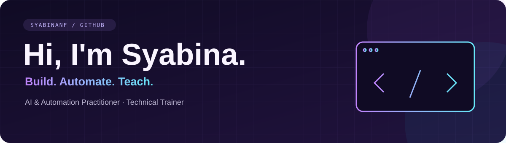

### AI & Automation Practitioner · Technical Trainer

**From AI workflows to mobile apps — built to solve practical problems.**

 

---

### ✨ About me

I build practical AI workflows and develop hands-on training materials that help people apply technology to everyday work.

My projects span **AI-powered content workflows, computer vision, mobile attendance apps, and logistics dashboards**. I combine building with teaching: turning technical concepts into tools people can use and lessons they can follow.

### 🎯 My focus

| Area | What I work on |
| :--- | :--- |
| 🤖 **AI & Automation** | AI agents, n8n, Make, and knowledge-based assistants. |
| 🎓 **Technical Training** | AI literacy, prompt engineering, programming, and workflow automation. |
| 📊 **Data & Web Projects** | Python, SQL, data processing, and interactive dashboards. |
| 📱 **Mobile & Computer Vision** | Flutter, Kotlin, Jetpack Compose, face recognition, and on-device ML. |

### 🚀 Project spotlight

<table>
<tr>
<td width="50%" valign="top">

#### 🤖 AI Content Automation
**From topics to carousel assets.**

n8n workflows for AI scripts, image generation, Google Drive delivery, and processing status updates.

`n8n` `Gemini` `OpenAI` `Google Workspace`

</td>
<td width="50%" valign="top">

#### 🗺️ Hub Dwell Monitor
**Turn logistics data into a clear view.**

A training dashboard with simulated hub data, dwell-time KPIs, search, filters, and interactive maps.

`React` `Vite` `Leaflet` `Papa Parse`

</td>
</tr>
<tr>
<td width="50%" valign="top">

#### 📱 Mobile Attendance
**Camera, recognition, and location.**

Flutter attendance modules with MobileFaceNet and a companion Laravel backend.

`Flutter` `Dart` `TensorFlow Lite` `Laravel`

</td>
<td width="50%" valign="top">

#### 🧠 Computer Vision
**Explore ML beyond the notebook.**

Python face-attendance experiments and Android skin-image ML with bundled TensorFlow Lite models.

`Python` `OpenCV` `Kotlin` `Jetpack Compose`

</td>
</tr>
</table>

<b>📂 Browse the project collection</b>

| Project | What you'll find | Stack |
| :--- | :--- | :--- |
| **[AI Content Automation](https://github.com/syabinanf/Automation123)** | n8n workflows connecting topic sheets, AI carousel scripts, image generation, Drive uploads, email delivery, and processing statuses. | n8n · Gemini · OpenAI · Google Workspace |
| **[Hub Dwell Monitor](https://github.com/syabinanf/supervisor-hub-monitor)** | A logistics training dashboard with simulated hub data, dwell-time KPIs, search, filters, and an interactive map. | React · Vite · Leaflet · Papa Parse |
| **[Mobile Attendance](https://github.com/syabinanf/presensi-flutter)** | A Flutter attendance project with face-recognition modules, a MobileFaceNet model, camera integration, and location support. | Flutter · Dart · TensorFlow Lite |
| **[Attendance Backend](https://github.com/syabinanf/presensi-backend)** | The Laravel backend project for the attendance system. | PHP · Laravel |
| **[Face Attendance](https://github.com/syabinanf/absensi-wajah)** | A webcam-based face-recognition prototype that records attendance timestamps to CSV. | Python · OpenCV · face_recognition |
| **[Skin-Cancer](https://github.com/syabinanf/Skin-Cancer)** | An Android project exploring skin-image ML with bundled TensorFlow Lite models and a Compose interface. | Kotlin · Jetpack Compose · TensorFlow Lite |

### 🛠️ My toolkit

**Code & Data**

**Mobile, Web & Computer Vision**

**AI & Automation**

---

**I enjoy turning technical concepts into useful tools and clear learning experiences.**

 

